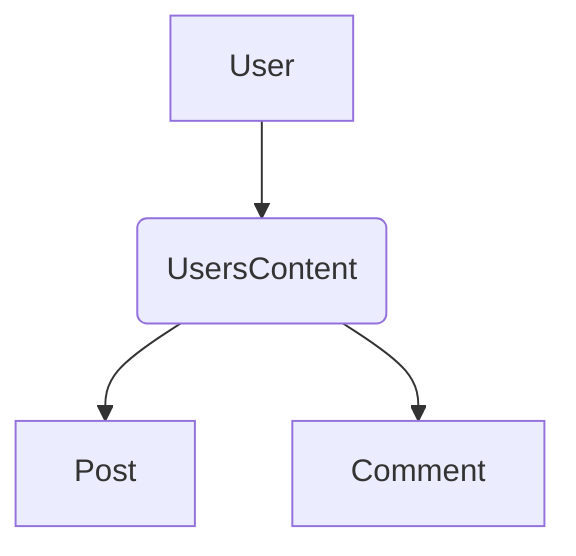

# Graphing

Ecto traditionally is made for relational databases and hence relations between schemas is
represented in such a way. A graph relation (edges) can be thought of as many-to-many relations in
the relational database world. When it comes to representing graph relations in Ecto, that is
exactly how it works in ArangoXEcto.

To use a graph relation you define an `outgoing` and an `incoming` relation on the two schemas,
for example the following will create a graph relationship between `User -> UserPost -> Post`.
The `UserPost` edge module will be created automatically.

    defmodule MyApp.User do
      schema "users" do
        field :first_name, :string
        field :last_name, :string

        outgoing :posts, MyApp.Post
      end
    end

    defmodule MyApp.Post do
      schema "posts" do
        field :title, :string

        incoming :users, MyApp.User
      end
    end

Behind the scenes this works very similar to a `many_to_many` relationships but has a few key
differences. As you may know, in a graph an edge can have multiple different node types that it
connects to/from. ArangoXEcto uses a special relation type that is based on the principal of
many-to-many but modified to allow such relationships.

For example, you may have a `User` schema that you want to connect to `Post` and `Comment`. You
may not want to have two seperate relationships (e.g. `:posts` and `:comments`) and want to
combine it all under one (e.g. `:content`). This is what the ArangoXEcto adapter enables. You can
read more about this type of relationship below.

### Edge Modules

When in dynamic mode the ArangoXEcto adapter dynamically creates and manages edge collections.
Each edge collection will be created as an Ecto schema when they are first used. This means that
you don't need to create edge collections manually. When in static mode you need to define edges
manually.

The edge module will be created under the closest common parent module of the passed modules
plus the `Edges` alias. The order of the edge name will always be alphabetical to prevent
duplicate edges. For example, if the modules were `MyApp.Apple.User` and `MyApp.Apple.Banana.Post`
then the edge would be created at `MyApp.Apple.Edges.PostUser`. This assumes that the edge
collection name was generated and not explicitly defined, if it was `PostUser` would be replaced
with the camel case of that collection name (i.e. `address_people` would be `AddressPeople`).

### Multiple edge schemas

Creating a graph relation that has multiple schemas through the same edge is possible in
ArangoXEcto. For example, take the following.

Users can have posts or comments through the same edge. This works because edges can have multiple
from and to schemas. For example if we were to define the `UsersContent` edge it would look like
this:

    defmodule MyApp.Edges.UsersContent do
      use ArangoXEcto.Edge,
          from: User,
          to: [Post, Comment]

      schema "users_content" do
        edge_fields()
      end
    end

We can then define our outgoing definition for the User schema like the following.

    defmodule MyApp.User do
      schema "users" do
        field :first_name, :string
        field :last_name, :string

        outgoing(
          :my_content,
          %{
            Post => &Post.changeset/2,
            Comment => &Comment.changeset/2
          },
          edge: ArangoXEcto.Edges.UsersContents
        )
      end
    end

The definition of outgoing here is slightly different from above. Instead of specifying a single
schema module we specify a map where the keys are schema modules and the values are a list of
field names to check if it exists in a result to match it with the module. This is an OR
condition, so if you had `[:a, :b]` that would mean if a result had `:a` it would match or if it
had `:b` it would match. If a result had both it would match.

Notice that the edge here was explicitly defined. This is not necessary if you aren't doing
anything custom on the edge and not including this would just generate an edge like the one
above. But remember a migration is still required when in static mode.

You can also do the same with the `ArangoXEcto.Schema.incoming/3` function.

#### Preloading

Due to how graph relations work the regular `c:Ecto.Repo.preload/3` function will only return maps
instead of structs. If you want to preload the structs you can use the `ArangoXEcto.preload/4`
function.

    iex> Repo.all(User) |> ArangoXEcto.preload(Repo, [:my_content])
    [%User{id: 123, my_content: [%Post{...}, %Comment{...}]}]
